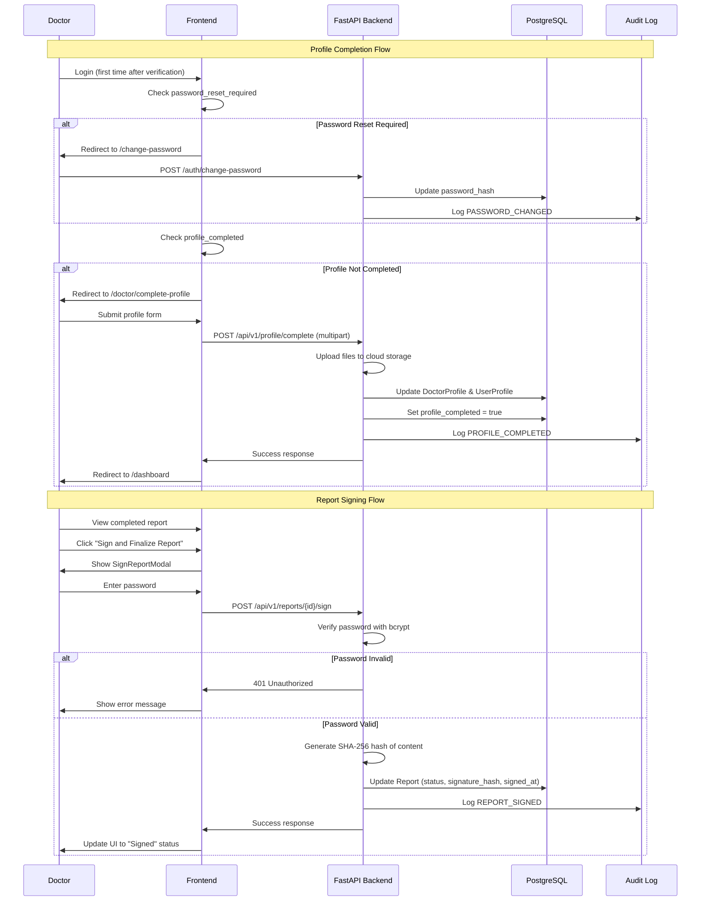

# Design Document: Doctor Profile Completion and Digital Signature System

## Overview

This design implements a two-part feature for SynapseAI: a mandatory profile completion workflow for newly verified doctors and a secure digital signature system for clinical reports. The solution ensures data integrity, legal compliance, and non-repudiation through password re-authentication and cryptographic audit trails.

### Key Design Goals

1. **Mandatory Onboarding**: Force profile completion before dashboard access
2. **Single Source of Truth**: Profile data populates all official documents
3. **Secure Signing**: Password re-authentication with SHA-256 fingerprinting
4. **Audit Compliance**: Complete audit trail for legal defensibility
5. **Seamless Integration**: Leverage existing FastAPI/PostgreSQL/Next.js stack

## Architecture

### System Flow



## Components and Interfaces

### Backend Components

#### 1. Database Schema Modifications

**DoctorProfile Model Changes**
```python
# New field in backend/app/models/doctor_profile.py
qualifications = Column(String(255), nullable=True)
```

**Report Model Changes**
```python
# New field in backend/app/models/report.py
signature_hash = Column(String(64), nullable=True)  # SHA-256 hash
```

**Alembic Migration**
```bash
# Generate migration
alembic revision --autogenerate -m "add_profile_qualifications_and_signature_hash"

# Apply migration
alembic upgrade head
```

#### 2. API Endpoints

**Complete Profile Endpoint**

```python
# Endpoint: POST /api/v1/profile/complete
# File: backend/app/api/api_v1/endpoints/profile.py

@router.post("/complete")
async def complete_profile(
    qualifications: str = Form(...),
    clinic_name: str = Form(...),
    clinic_address: str = Form(...),
    phone: str = Form(...),
    logo: UploadFile = File(None),
    digital_signature: UploadFile = File(...),
    current_user: User = Depends(get_current_doctor),
    db: Session = Depends(get_db)
):
    """
    Complete doctor profile after first login.
    
    Request:
        - qualifications: Doctor credentials (e.g., "MBBS, DPM")
        - clinic_name: Name of clinic/practice
        - clinic_address: Full clinic address
        - phone: Contact phone number
        - logo: Clinic logo image file (optional)
        - digital_signature: Doctor's signature image file (required)
    
    Response:
        - profile: Updated profile data
        - message: Success message
    
    Security:
        - Requires authenticated doctor user
        - Validates file types and sizes
        - Stores files in secure cloud storage
    """
```

**Sign Report Endpoint**

```python
# Endpoint: POST /api/v1/reports/{report_id}/sign
# File: backend/app/api/api_v1/endpoints/reports.py

@router.post("/{report_id}/sign")
async def sign_report(
    report_id: str,
    sign_request: SignReportRequest,
    current_user: User = Depends(get_current_doctor),
    db: Session = Depends(get_db),
    request: Request
):
    """
    Digitally sign a completed clinical report.
    
    Request Body:
        {
            "password": "doctor_current_password"
        }
    
    Response:
        {
            "report_id": "uuid",
            "status": "signed",
            "signed_at": "2025-10-18T12:00:00Z",
            "signature_hash": "sha256_hash"
        }
    
    Security:
        - Requires authenticated doctor user
        - Verifies report ownership
        - Re-authenticates with password
        - Creates audit log entry
        - Generates SHA-256 content fingerprint
    """
```

#### 3. Service Layer

**File Upload Service**
```python
# File: backend/app/services/file_upload_service.py

class FileUploadService:
    """Handles secure file uploads to cloud storage."""
    
    async def upload_file(
        self,
        file: UploadFile,
        user_id: str,
        file_type: str
    ) -> str:
        """
        Upload file to Google Cloud Storage.
        
        Args:
            file: Uploaded file object
            user_id: User ID for path organization
            file_type: Type of file (logo, signature)
        
        Returns:
            Public URL of uploaded file
        
        Validation:
            - File size < 5MB
            - Allowed formats: jpg, jpeg, png
            - Sanitize filename
        """
```

**Report Signing Service**
```python
# File: backend/app/services/report_signing_service.py

class ReportSigningService:
    """Handles secure report signing with audit trails."""
    
    def generate_signature_hash(self, content: str) -> str:
        """Generate SHA-256 hash of report content."""
        return hashlib.sha256(content.encode('utf-8')).hexdigest()
    
    async def sign_report(
        self,
        report: Report,
        user: User,
        password: str,
        db: Session,
        request: Request
    ) -> Report:
        """
        Sign report with password verification and audit logging.
        
        Steps:
            1. Verify report ownership
            2. Verify report status is 'completed'
            3. Re-authenticate password
            4. Generate content hash
            5. Update report record
            6. Create audit log
        """
```

#### 4. Schema Definitions

**Profile Completion Request**
```python
# File: backend/app/schemas/profile.py

class ProfileCompletionRequest(BaseModel):
    qualifications: str = Field(..., max_length=255)
    clinic_name: str = Field(..., max_length=255)
    clinic_address: str = Field(..., max_length=1000)
    phone: str = Field(..., pattern=r'^\+?[1-9]\d{1,14}$')
    
    class Config:
        json_schema_extra = {
            "example": {
                "qualifications": "MBBS, MD (Psychiatry), DPM",
                "clinic_name": "Mind Wellness Clinic",
                "clinic_address": "123 Health Street, Mumbai, MH 400001",
                "phone": "+919876543210"
            }
        }
```

**Sign Report Request**
```python
# File: backend/app/schemas/report.py

class SignReportRequest(BaseModel):
    password: str = Field(..., min_length=8)
    
class SignReportResponse(BaseModel):
    report_id: str
    status: str
    signed_at: datetime
    signed_by: str
    signature_hash: str
```

#### 5. Audit Log Enhancement

**New Event Types**
```python
# File: backend/app/models/audit_log.py

class AuditEventType(str, Enum):
    # ... existing events ...
    REPORT_SIGNED = "report_signed"
    REPORT_SIGN_FAILED = "report_sign_failed"
```

**Audit Log Entry Structure**
```python
{
    "event_type": "REPORT_SIGNED",
    "doctor_user_id": "uuid",
    "ip_address": "192.168.1.1",
    "user_agent": "Mozilla/5.0...",
    "details": {
        "report_id": "uuid",
        "signature_hash": "sha256_hash",
        "report_type": "consultation",
        "patient_id": "uuid"
    },
    "timestamp": "2025-10-18T12:00:00Z"
}
```

### Frontend Components

#### 1. Middleware Flow Control

**Authentication Middleware Enhancement**
```typescript
// File: frontend/src/middleware.ts

export async function middleware(request: NextRequest) {
  const token = request.cookies.get('auth_token')?.value;
  
  if (!token) {
    return NextResponse.redirect(new URL('/login', request.url));
  }
  
  const user = await verifyToken(token);
  
  // Step 1: Check password reset requirement
  if (user.password_reset_required) {
    if (!request.nextUrl.pathname.startsWith('/change-password')) {
      return NextResponse.redirect(new URL('/change-password', request.url));
    }
  }
  
  // Step 2: Check profile completion (doctors only)
  if (user.role === 'doctor' && !user.profile_completed) {
    if (!request.nextUrl.pathname.startsWith('/doctor/complete-profile')) {
      return NextResponse.redirect(new URL('/doctor/complete-profile', request.url));
    }
  }
  
  return NextResponse.next();
}
```

#### 2. Complete Profile Page

**Component Structure**
```typescript
// File: frontend/src/app/doctor/complete-profile/page.tsx

interface ProfileCompletionForm {
  qualifications: string;
  clinic_name: string;
  clinic_address: string;
  phone: string;
  logo?: File;
  digital_signature: File;
}

export default function CompleteProfilePage() {
  // Form state management
  // File upload handling
  // Form validation
  // API submission
  // Success redirect to dashboard
}
```

**UI Sections**
1. **Header**: Welcome message with doctor's name
2. **Practice Details Section**:
   - Clinic Logo upload (optional)
   - Clinic Name input
   - Clinic Address textarea
   - Phone input with validation
3. **Professional Details Section**:
   - Qualifications input (e.g., "MBBS, MD")
   - Full Name (read-only, from registration)
   - Medical Registration Number (read-only)
4. **Digital Signature Section**:
   - Signature image upload (required)
   - Preview of uploaded signature
5. **Action Button**: "Save and Continue"

**Design System Compliance**
- Use existing SynapseAI color palette
- Apply glassmorphism effects for cards
- Consistent typography and spacing
- Responsive layout for mobile/tablet
- Accessibility: ARIA labels, keyboard navigation

#### 3. Sign Report Modal

**Component Structure**
```typescript
// File: frontend/src/components/reports/SignReportModal.tsx

interface SignReportModalProps {
  reportId: string;
  isOpen: boolean;
  onClose: () => void;
  onSuccess: () => void;
}

export function SignReportModal({
  reportId,
  isOpen,
  onClose,
  onSuccess
}: SignReportModalProps) {
  const [password, setPassword] = useState('');
  const [error, setError] = useState('');
  const [loading, setLoading] = useState(false);
  
  const handleSign = async () => {
    // Call API to sign report
    // Handle success/error
  };
  
  return (
    <Modal isOpen={isOpen} onClose={onClose}>
      <ModalHeader>Sign and Finalize Report</ModalHeader>
      <ModalBody>
        <Alert variant="warning">
          This action is final and cannot be undone. By signing this report,
          you certify that the information is accurate and complete.
        </Alert>
        
        <PasswordInput
          label="Confirm Your Password"
          value={password}
          onChange={setPassword}
          error={error}
        />
      </ModalBody>
      <ModalFooter>
        <Button variant="secondary" onClick={onClose}>
          Cancel
        </Button>
        <Button
          variant="primary"
          onClick={handleSign}
          loading={loading}
          disabled={!password}
        >
          Confirm & Sign
        </Button>
      </ModalFooter>
    </Modal>
  );
}
```

**Integration Point**
```typescript
// File: frontend/src/app/reports/[id]/page.tsx

export default function ReportDetailPage({ params }: { params: { id: string } }) {
  const [showSignModal, setShowSignModal] = useState(false);
  const { report, refetch } = useReport(params.id);
  
  const canSign = report?.status === 'completed' && !report?.signed_at;
  
  return (
    <div>
      {/* Report content */}
      
      {canSign && (
        <Button onClick={() => setShowSignModal(true)}>
          Sign and Finalize Report
        </Button>
      )}
      
      <SignReportModal
        reportId={params.id}
        isOpen={showSignModal}
        onClose={() => setShowSignModal(false)}
        onSuccess={() => {
          setShowSignModal(false);
          refetch();
        }}
      />
    </div>
  );
}
```

## Data Models

### Database Schema Changes

**DoctorProfile Table**
```sql
ALTER TABLE doctor_profiles
ADD COLUMN qualifications VARCHAR(255);
```

**Reports Table**
```sql
ALTER TABLE reports
ADD COLUMN signature_hash VARCHAR(64);
```

### Data Flow

**Profile Completion Data Flow**
```
User Input → Form Validation → File Upload → API Request → Database Update → Audit Log → Redirect
```

**Report Signing Data Flow**
```
User Action → Modal Display → Password Input → API Request → Password Verification → Hash Generation → Database Update → Audit Log → UI Update
```

## Error Handling

### Backend Error Scenarios

1. **Profile Completion Errors**
   - Invalid file format: Return 400 with message "Invalid file format. Allowed: jpg, jpeg, png"
   - File too large: Return 413 with message "File size exceeds 5MB limit"
   - Missing required fields: Return 422 with validation errors
   - Upload failure: Return 500 with message "File upload failed. Please try again"

2. **Report Signing Errors**
   - Report not found: Return 404 with message "Report not found"
   - Unauthorized access: Return 403 with message "You do not have permission to sign this report"
   - Invalid password: Return 401 with message "Incorrect password"
   - Report not completed: Return 400 with message "Report must be completed before signing"
   - Already signed: Return 400 with message "Report has already been signed"

### Frontend Error Handling

1. **Form Validation**
   - Real-time validation for all inputs
   - Clear error messages below each field
   - Disable submit button until all required fields are valid

2. **API Error Display**
   - Toast notifications for success/error
   - Inline error messages in modal
   - Retry mechanism for network failures

3. **File Upload Feedback**
   - Progress indicators during upload
   - Preview of uploaded images
   - Clear error messages for invalid files

## Testing Strategy

### Backend Testing

**Unit Tests**
```python
# test_profile_completion.py
def test_complete_profile_success()
def test_complete_profile_missing_signature()
def test_complete_profile_invalid_file_type()
def test_complete_profile_file_too_large()

# test_report_signing.py
def test_sign_report_success()
def test_sign_report_invalid_password()
def test_sign_report_not_owner()
def test_sign_report_already_signed()
def test_sign_report_not_completed()
def test_signature_hash_generation()
```

**Integration Tests**
```python
# test_profile_workflow.py
def test_full_profile_completion_workflow()
def test_profile_completion_blocks_dashboard_access()

# test_signing_workflow.py
def test_full_report_signing_workflow()
def test_audit_log_creation_on_signing()
```

### Frontend Testing

**Component Tests**
```typescript
// CompleteProfilePage.test.tsx
describe('CompleteProfilePage', () => {
  it('renders all form sections')
  it('validates required fields')
  it('handles file uploads')
  it('submits form successfully')
  it('redirects to dashboard on success')
})

// SignReportModal.test.tsx
describe('SignReportModal', () => {
  it('displays warning message')
  it('validates password input')
  it('handles signing success')
  it('displays error on invalid password')
  it('disables sign button when loading')
})
```

**E2E Tests**
```typescript
// profile-completion.e2e.ts
describe('Profile Completion Flow', () => {
  it('redirects new doctor to complete profile')
  it('blocks dashboard access until profile complete')
  it('allows dashboard access after completion')
})

// report-signing.e2e.ts
describe('Report Signing Flow', () => {
  it('enables sign button for completed reports')
  it('requires password to sign')
  it('updates report status after signing')
  it('creates audit log entry')
})
```

## Security Considerations

### Authentication & Authorization

1. **Profile Completion**
   - Requires authenticated doctor user
   - Can only update own profile
   - One-time operation (profile_completed flag prevents re-entry)

2. **Report Signing**
   - Requires authenticated doctor user
   - Verifies report ownership
   - Password re-authentication required
   - Cannot sign already-signed reports

### Data Protection

1. **File Uploads**
   - Validate file types (whitelist: jpg, jpeg, png)
   - Limit file size (5MB max)
   - Sanitize filenames
   - Store in secure cloud storage with access controls
   - Generate unique filenames to prevent collisions

2. **Password Handling**
   - Never log passwords
   - Use bcrypt for verification (existing implementation)
   - Clear password from memory after verification
   - Rate limit signing attempts

3. **Signature Hash**
   - Use SHA-256 for content fingerprinting
   - Store hash in database for verification
   - Include hash in audit log
   - Immutable once created

### Audit Trail

1. **Profile Completion**
   - Log PROFILE_COMPLETED event
   - Include user ID, timestamp, IP address
   - Store in tamper-evident audit log

2. **Report Signing**
   - Log REPORT_SIGNED event
   - Include report ID, signature hash, timestamp
   - Log failed attempts (REPORT_SIGN_FAILED)
   - Retain for 7 years (HIPAA compliance)

## Performance Considerations

### File Upload Optimization

1. **Client-Side**
   - Compress images before upload
   - Show upload progress
   - Validate files before sending

2. **Server-Side**
   - Stream files to cloud storage
   - Use async upload operations
   - Implement retry logic for failures

### Database Optimization

1. **Indexes**
   - Index on `doctor_profiles.profile_completed` for quick lookups
   - Index on `reports.status` for filtering signable reports
   - Index on `audit_logs.event_type` for audit queries

2. **Query Optimization**
   - Use selective field loading
   - Implement caching for profile data
   - Batch audit log writes

## Deployment Considerations

### Database Migration

```bash
# Development
alembic revision --autogenerate -m "add_profile_qualifications_and_signature_hash"
alembic upgrade head

# Production
# 1. Backup database
# 2. Run migration in maintenance window
# 3. Verify data integrity
# 4. Monitor for errors
```

### Environment Variables

```bash
# Add to .env
GCP_STORAGE_BUCKET=synapseai-uploads
GCP_STORAGE_PATH_LOGOS=doctor-logos
GCP_STORAGE_PATH_SIGNATURES=doctor-signatures
MAX_FILE_SIZE_MB=5
ALLOWED_IMAGE_FORMATS=jpg,jpeg,png
```

### Rollback Plan

1. **Database Rollback**
   ```bash
   alembic downgrade -1
   ```

2. **Feature Flag**
   - Implement feature flag for profile completion enforcement
   - Can disable if critical issues arise
   - Allows gradual rollout

3. **Data Recovery**
   - Backup database before deployment
   - Keep audit logs for recovery
   - Document rollback procedures

## Future Enhancements

1. **Advanced Signature Verification**
   - Implement digital certificate-based signatures
   - Add timestamp authority integration
   - Support for multiple signature formats

2. **Profile Versioning**
   - Track profile changes over time
   - Allow viewing historical profile data
   - Audit trail for profile modifications

3. **Bulk Operations**
   - Batch report signing
   - Signature templates
   - Automated signing workflows

4. **Mobile Support**
   - Native mobile app integration
   - Biometric authentication for signing
   - Offline signature capability
