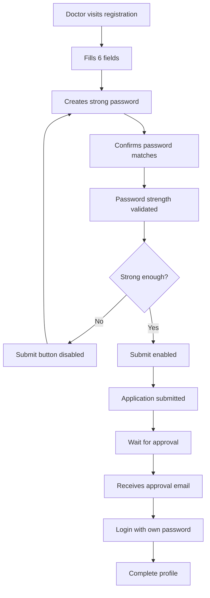
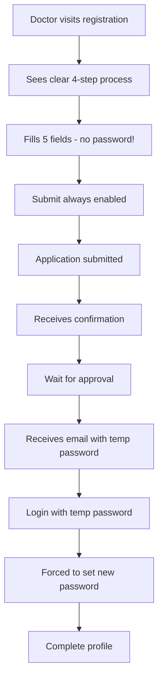

# Doctor Registration - Before vs After Comparison

## Visual Form Comparison

### BEFORE (Old Registration Form)
```
┌─────────────────────────────────────────┐
│     🏥 Doctor Registration              │
│     Join SynapseAI as a verified        │
│     psychiatrist                        │
├─────────────────────────────────────────┤
│                                         │
│  Full Name *                            │
│  ┌───────────────────────────────────┐ │
│  │ Dr. John Doe                      │ │
│  └───────────────────────────────────┘ │
│                                         │
│  Email Address *                        │
│  ┌───────────────────────────────────┐ │
│  │ doctor@example.com                │ │
│  └───────────────────────────────────┘ │
│                                         │
│  Medical Registration Number *          │
│  ┌───────────────────────────────────┐ │
│  │ 12345/A/2020                      │ │
│  └───────────────────────────────────┘ │
│                                         │
│  State Medical Council *                │
│  ┌───────────────────────────────────┐ │
│  │ Maharashtra Medical Council    ▼  │ │
│  └───────────────────────────────────┘ │
│                                         │
│  Password *                             │
│  ┌───────────────────────────────────┐ │
│  │ ••••••••••••••                 👁  │ │
│  └───────────────────────────────────┘ │
│                                         │
│  Password Strength:  [██████░░] Good   │
│  Requirements:                          │
│  ✓ At least 8 characters                │
│  ✓ One uppercase letter                 │
│  ✓ One number                           │
│  ✗ One special character                │
│                                         │
│  Confirm Password *                     │
│  ┌───────────────────────────────────┐ │
│  │ ••••••••••••••                 👁  │ │
│  └───────────────────────────────────┘ │
│  ✓ Passwords match                      │
│                                         │
│  ┌───────────────────────────────────┐ │
│  │      Submit Application       🔒  │ │  (Disabled until password is strong)
│  └───────────────────────────────────┘ │
│                                         │
│  Already have an account? Login here    │
└─────────────────────────────────────────┘
```

### AFTER (New Registration Form)
```
┌─────────────────────────────────────────┐
│     🏥 Doctor Registration              │
│     Join SynapseAI as a verified        │
│     psychiatrist                        │
├─────────────────────────────────────────┤
│  ╔═══════════════════════════════════╗ │
│  ║ 📋 Registration Process           ║ │
│  ║                                   ║ │
│  ║ 1. Submit your application below  ║ │
│  ║ 2. Admin will review credentials  ║ │
│  ║ 3. Upon approval, you'll receive  ║ │
│  ║    login credentials via email    ║ │
│  ║ 4. Log in and set your permanent  ║ │
│  ║    password                        ║ │
│  ╚═══════════════════════════════════╝ │
│                                         │
│  Full Name *                            │
│  ┌───────────────────────────────────┐ │
│  │ Dr. John Doe                      │ │
│  └───────────────────────────────────┘ │
│                                         │
│  Email Address *                        │
│  ┌───────────────────────────────────┐ │
│  │ doctor@example.com                │ │
│  └───────────────────────────────────┘ │
│                                         │
│  Phone Number *                         │  ⭐ NEW FIELD
│  ┌───────────────────────────────────┐ │
│  │ 9876543210                        │ │
│  └───────────────────────────────────┘ │
│  10-digit Indian mobile number          │
│                                         │
│  Medical Registration Number *          │
│  ┌───────────────────────────────────┐ │
│  │ 12345/A/2020                      │ │
│  └───────────────────────────────────┘ │
│                                         │
│  State Medical Council *                │
│  ┌───────────────────────────────────┐ │
│  │ Maharashtra Medical Council    ▼  │ │
│  └───────────────────────────────────┘ │
│                                         │
│  ┌───────────────────────────────────┐ │
│  │      Submit Application       ✓   │ │  ⭐ Always enabled
│  └───────────────────────────────────┘ │
│                                         │
│  Already have an account? Login here    │
└─────────────────────────────────────────┘
```

## Key Differences

| Aspect | BEFORE | AFTER |
|--------|--------|-------|
| **Password Field** | ✅ Required | ❌ Removed |
| **Confirm Password** | ✅ Required | ❌ Removed |
| **Password Strength Indicator** | ✅ Shown | ❌ Removed |
| **Phone Number** | ❌ Not collected | ✅ Required |
| **Process Information** | ❌ None | ✅ Clear 4-step guide |
| **Submit Button** | Disabled until strong password | Always enabled (unless loading) |
| **Form Fields** | 6 fields | 5 fields |
| **Form Height** | ~800px | ~650px (shorter) |
| **Time to Complete** | ~2-3 minutes | ~1-2 minutes |

## User Experience Flow

### BEFORE


### AFTER


## Success Message Comparison

### BEFORE
```
┌─────────────────────────────────────────────┐
│           ✓ Application Submitted           │
│            Successfully!                     │
│                                             │
│  Thank you for applying to join            │
│  SynapseAI as a verified psychiatrist.     │
│  We've received your application and       │
│  will review it shortly.                   │
│                                             │
│  What Happens Next?                         │
│  1. Credential Verification                 │
│  2. Application Review (2-3 days)          │
│  3. Email Notification                      │
│  4. Account Activation                      │
│                                             │
│  [Back to Home]                            │
└─────────────────────────────────────────────┘
```

### AFTER
```
┌─────────────────────────────────────────────┐
│           ✓ Application Submitted           │
│            Successfully!                     │
│                                             │
│  Thank you for registering! Your           │
│  application has been submitted for        │
│  review. You will receive an email with    │  ⭐ CLEARER MESSAGE
│  login credentials once your application   │
│  is approved.                              │
│                                             │
│  What Happens Next?                         │
│  1. Credential Verification                 │
│  2. Admin Review (2-3 days)                │
│  3. Login Credentials (via email)          │  ⭐ UPDATED
│  4. Set Your Password                      │  ⭐ NEW STEP
│                                             │
│  [Back to Home]                            │
└─────────────────────────────────────────────┘
```

## API Request Comparison

### BEFORE
```json
POST /api/v1/doctor/register

Request:
{
  "fullName": "Dr. John Doe",
  "email": "john@example.com",
  "password": "SecurePass123!",
  "medicalRegistrationNumber": "12345/A/2020",
  "stateMedicalCouncil": "Maharashtra"
}

Response:
{
  "status": "success",
  "data": {
    "message": "Application submitted",
    "application_id": "abc123",
    "expected_review": "2-3 business days"
  }
}
```

### AFTER
```json
POST /api/v1/doctor/register

Request:
{
  "fullName": "Dr. John Doe",
  "email": "john@example.com",
  "phone": "9876543210",                    ⭐ NEW
  "medicalRegistrationNumber": "12345/A/2020",
  "stateMedicalCouncil": "Maharashtra"
}

Response:
{
  "status": "success",
  "data": {
    "message": "Application submitted",
    "application_id": "abc123",
    "expected_review": "2-3 business days",
    "phone_stored": true                     ⭐ NEW
  }
}
```

## Backend Database Changes

### User Record - BEFORE
```python
User {
  id: "user_123",
  email: "john@example.com",
  email_hash: "hash...",
  password_hash: "bcrypt_hash_of_user_password",  # User's chosen password
  role: "doctor",
  doctor_status: "pending",
  is_active: False,
  password_reset_required: False
}
```

### User Record - AFTER
```python
User {
  id: "user_123",
  email: "john@example.com",
  email_hash: "hash...",
  password_hash: "bcrypt_hash_of_random_placeholder",  ⭐ Secure placeholder
  role: "doctor",
  doctor_status: "pending",
  is_active: False,
  password_reset_required: True                        ⭐ Flag set
}
```

### Doctor Profile - BEFORE
```python
DoctorProfile {
  user_id: "user_123",
  full_name: "Dr. John Doe",
  medical_registration_number: "12345/A/2020",
  state_medical_council: "Maharashtra",
  phone_number: null,                                  # Not collected
  application_date: "2025-10-05",
  profile_completed: False
}
```

### Doctor Profile - AFTER
```python
DoctorProfile {
  user_id: "user_123",
  full_name: "Dr. John Doe",
  medical_registration_number: "12345/A/2020",
  state_medical_council: "Maharashtra",
  phone_number: "9876543210",                          ⭐ Now collected
  application_date: "2025-10-05",
  profile_completed: False
}
```

## Benefits Summary

### For Doctors
✅ **Faster Registration** - One less field to fill (actually 3 less: password, confirm, strength check)
✅ **No Password Stress** - Don't need to think of a secure password immediately
✅ **Clear Process** - Know exactly what to expect
✅ **Mobile-Friendly** - Shorter form works better on mobile
✅ **Professional** - Feels like enterprise-grade SaaS

### For Admins
✅ **Better Security** - Generate strong temporary passwords
✅ **More Control** - Only approved doctors get credentials
✅ **Contact Info** - Have phone number from the start
✅ **Less Support** - Fewer "forgot password" requests during registration

### For System
✅ **Better Security** - Admin-generated passwords are typically stronger
✅ **Audit Trail** - Clear record of who approved and when credentials were issued
✅ **Lower Risk** - Accounts can't be used until approved
✅ **Cleaner Code** - Less validation complexity in registration form

## Migration Notes

### For Existing Users
- No action required - existing doctors keep their passwords
- Only affects NEW registrations

### For Testing
```bash
# Test the new registration flow
curl -X POST http://localhost:8080/api/v1/doctor/register \
  -H "Content-Type: application/json" \
  -d '{
    "fullName": "Dr. Test User",
    "email": "test@example.com",
    "phone": "9876543210",
    "medicalRegistrationNumber": "TEST123",
    "stateMedicalCouncil": "Delhi"
  }'
```

---

**Summary:** The new flow is cleaner, faster, more secure, and more professional. It reduces friction during registration while maintaining (and improving) security through admin-controlled credential generation.
